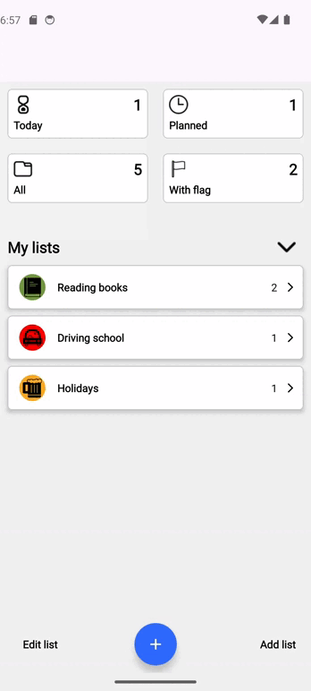
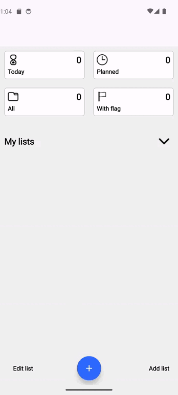
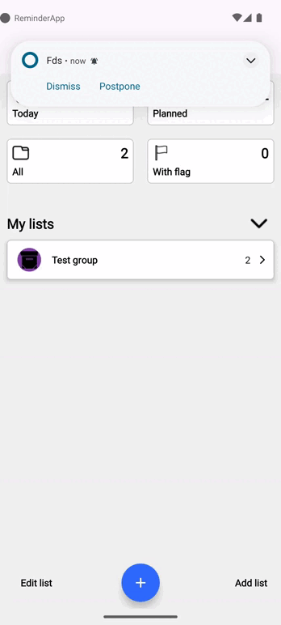

# Reminder App
Reminder App is a simple and easy-to-use app for scheduling tasks and creating reminders with an alarm to notify you of events. It allows you to view different categories of tasks such as "Today", "Scheduled", "With flag" and others, as well as create your own reminder groups

  <table>
    <tr>
      <td align="center">
        <b>Main</b> 
        
      </td>
      <td align="center">
        <b>Create reminder</b> 
        
      </td>
      <td align="center">
        <b>Working with notifications</b> 
        
      </td>
    </tr>
  </table>

## [Technical specification](https://docs.google.com/document/d/19XhJmlF7N2XAbsMtn6GcUCHimHzeerOJBmJD9-WybGM/edit)

## Features

* Creating periodic or one-time reminders
* Notification when a reminder expires
* Ability to make a reminder inactive, thus disabling notifications
* Categorizing reminders
* Create custom reminder groups
* Edge-to-edge
* Light and Dark themes
* UI and Unit testing

## Tech Stack

* Support for Android 8.0+ (SDK 26+)
* Fully Kotlin
* [MVVM](https://developer.android.com/topic/libraries/architecture) for the architecture
* [XML](https://developer.android.com/reference/android/util/Xml) for the UI
* [Material3](https://developer.android.com/jetpack/compose/designsystems/material3) support for dynamic themes using Material 3
* [Koin](https://github.com/InsertKoinIO/koin) for DI pattern
* [Gson](https://github.com/google/gson) for serialization and deserialization
* [Coroutines](https://github.com/Kotlin/kotlinx.coroutines) for async
* [Room](https://developer.android.com/jetpack/androidx/releases/room) for local database
* [AlarmManager](https://developer.android.com/reference/android/app/AlarmManager) for schedule alarms
* [WorkManager](https://developer.android.com/reference/androidx/work/WorkManager) for scheduled works
* [Kaspresso](https://github.com/KasperskyLab/Kaspresso) for realization page-object pattern in UI tests
* [Mockk](https://mockk.io/ANDROID.html) for mocking in tests

